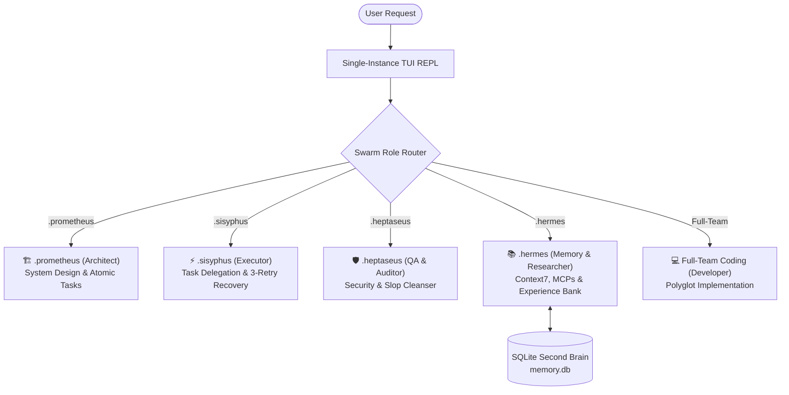

<div align="center">

# ✨ AGENTYX CLI v3.0.0
### *Platform Agentic AI Swarm CLI with 9router Integration, SQLite Second Brain & Gacor Vibe-Coding MCP Suite*

[](LICENSE)
[](https://nodejs.org)
[](#-cross-platform-installation)
[](#-gacor-mcp--skills-ecosystem)
[](#-swarm-agent-roles)

---

**Agentyx** adalah platform CLI Agentic AI otonom tingkat lanjut yang dirancang untuk pengembang perangkat lunak modern (*vibe coding*). Menggabungkan **Orkestrasi Multi-Agent Swarm**, **9router Multi-Model Router**, **SQLite Second Brain & Experience Bank**, serta **20 MCP Tools & Design Intelligence Skills** untuk memberikan pengalaman pengkodean yang presisi, indah, dan bebas dari halusinasi.

</div>

---

## 🌟 Fitur Utama (Key Features)

- 🤖 **Swarm Multi-Agent Engine**: Pilihan persona agen spesialis (`.prometheus`, `.sisyphus`, `.heptaseus`, `.hermes`, `Full-Team Coding`) dengan batas peran (*role boundary*) yang ketat.
- 🧠 **SQLite Second Brain & Experience Bank (`~/.agentyx/memory.db`)**: Mengingat pola error, trajektori eksekusi, dan solusi teknis terverifikasi agar agen tidak mengulang kesalahan di masa depan.
- 🔌 **20 Gacor MCP Tools & Skills**: Terintegrasi langsung dengan Context7 (Dokumentasi Live), Codebase Indexer (`MikeRecognex/mcp-codebase-index`), WebCrawl Offline RAG, Google Sheets, JamesANZ Memory, Token Optimizer, Shadcn UI Registry, Playwright, UI/UX Pro Max, AST-grep, DB Inspector, Docker, dan Sequential Thinking.
- 🔀 **9router Dynamic Model Switcher**: Beralih antar model AI (Claude 3.7 Sonnet, GPT-4o, DeepSeek-R1, Qwen 2.5) secara instan.
- ⌨️ **Single-Instance TUI REPL**: Antarmuka CLI interaktif yang stabil, bebas dari kebocoran event loop atau input ganda (*double input*).
- 🧹 **AI Slop Cleanser**: Pembersihan komentar redundan dan file sampah hasil generasi AI dengan 1-klik (`/slop`).
- 🌐 **Cross-Platform Native**: Berjalan dengan mulus di **Windows (PowerShell/CMD)**, **Linux**, dan **Termux Android**.

---

## 🏛️ Swarm Agent Roles

Agentyx menggunakan filosofi **Corrective Reasoning** di mana setiap agen Swarm memiliki tanggung jawab spesifik:



| Agent Persona | Role Title | Boundary & Primary Responsibility |
| :--- | :--- | :--- |
| **`.prometheus`** | Architect | Merancang arsitektur sistem, memecah tugas atomik, dan mengelola `workflow.md` & `prompt.md`. **(Strictly Non-Coding)** |
| **`.sisyphus`** | Executor & Task Runner | Mengorkestrasi delegasi tugas ke agen developer, menangani auto-retry error 3x, serta memperbarui `footprint.md`. |
| **`.heptaseus`** | QA & Security Auditor | Mengaudit sintaksis, header komentar, pembersihan AI slop, dan memiliki Hak Veto atas kode yang cacat. |
| **`.hermes`** | Memory & Research Specialist | Melakukan kueri ke SQLite Second Brain (`/experience`), riset dokumentasi Context7, eksekusi MCP, dan sanitasi stream. |
| **`Full-Team Coding`** | Executive Polyglot Developer | Menulis kode produksi idiomatik dalam semua bahasa (TS, Python, Rust, Go, C++, Java, PHP, Docker) dengan header standar. |

---

## 🔌 Gacor MCP & Skills Ecosystem

Agentyx dilengkapi dengan **20 MCP Tools & Design Intelligence Skills** bawaan:

| MCP Tool / Skill | Type | Status | Description |
| :--- | :---: | :---: | :--- |
| **`codebase-index`** | MCP Server | `ONLINE` | Pengindeksan codebase AST, pencarian simbol semantik, & resolusi call-graph (`MikeRecognex/mcp-codebase-index`). |
| **`webcrawl`** | MCP Server | `ONLINE` | Engine pencarian & RAG arsip web lokal (WARC, wget, ArchiveBox, HTTrack) (`pragmar/mcp-server-webcrawl`). |
| **`mcp-gsheets`** | MCP Server | `ONLINE` | Integrasi Google Sheets API untuk membaca/menulis cell, append baris data, & manajemen tab (`freema/mcp-gsheets`). |
| **`jamesanz-memory`** | MCP Server | `ONLINE` | Knowledge graph memori terstruktur lintas sesi, relasi entitas, & preferensi user (`JamesANZ/memory-mcp`). |
| **`token-optimizer`** | MCP Server | `ONLINE` | Penghemat token konteks, pembaruan file berbasis diff, & knowledge graph (`ooples/token-optimizer-mcp`). |
| **`shadcn-ui`** | MCP Server | `ONLINE` | Registry komponen shadcn/ui v4, template block UI, & React/Next.js demo extractor (`Jpisnice/shadcn-ui-mcp-server`). |
| **`context7`** | MCP Server | `ONLINE` | Lookup dokumentasi & contoh kode API terbaru dari Context7. |
| **`playwright`** | MCP Server | `ONLINE` | Otomasi browser headless, pengujian E2E frontend, & screenshot testing. |
| **`ui-ux-pro-max`** | MCP Server | `ONLINE` | System Design Intelligence, HSL palette, glassmorphism & micro-animations. |
| **`ast-grep`** | MCP Server | `ONLINE` | Search & rewrite kode berbasis AST struktural tanpa salah regex. |
| **`db-inspector`** | MCP Server | `ACTIVE` | Inspector skema database & SQL query runner untuk SQLite, Postgres, MySQL. |
| **`docker`** | MCP Server | `ACTIVE` | Container orchestrator, multi-service compose & log streaming engine. |
| **`reasoning`** | MCP Server | `ONLINE` | Multi-branch step-by-step reasoning engine (Sequential Thinking). |
| **`memory`** | MCP Server | `ACTIVE` | SQLite Second Brain (`~/.agentyx/memory.db`) & Experience Logger. |
| **`git`** | MCP Server | `ACTIVE` | Local repository versioning & commit management. |
| **`github`** | MCP Server | `ONLINE` | Remote repository synchronization & GitHub CLI integration. |
| **`grep`** | Internal Tool | `ACTIVE` | Ripgrep pattern matching engine. |
| **`terminal`** | Internal Tool | `ACTIVE` | Shell execution engine (PowerShell, CMD, Bash). |
| **`fetch`** | Internal Tool | `ACTIVE` | Web page & raw documentation content fetcher. |
| **`websearch`** | Internal Tool | `ACTIVE` | Live web search & citation aggregator. |

---

## 💻 Installation & Usage

### ⚙️ Prerequisites
- **Node.js**: v18.0.0 atau lebih baru
- **npm**: v9.0.0 atau lebih baru
- **Git** & **GitHub CLI (`gh`)** (Opsional untuk sync GitHub)

### 🚀 Cross-Platform Installation

#### 1. Clone & Build Repository
```bash
git clone https://github.com/jnckcode/agentyx.git
cd agentyx
npm install
npm run build
```

#### 2. Global CLI Link
Jalankan perintah berikut agar `agentyx` dapat dipanggil dari folder mana pun di terminal Anda:
```bash
npm link
```

---

### 📱 Installing on Termux (Android)

Agentyx berjalan 100% lancar di **Termux Android**:

```bash
# Update paket & install dependensi native C/C++
pkg update && pkg upgrade -y
pkg install nodejs-lts git clang make python sqlite -y

# Clone & Install
git clone https://github.com/jnckcode/agentyx.git
cd agentyx
npm install
npm run build
npm link

# Jalankan CLI
agentyx
```

---

## 🎮 Interactive Slash Commands Menu

Saat berada di dalam REPL Agentyx, ketik `/` untuk membuka **Interactive Slash Command Menu**:

```text
╔══════════════════════════════════════════════════════════════════════════╗
║    ✨ AGENTYX INTERACTIVE SLASH COMMAND MENU ✨                         ║
╚══════════════════════════════════════════════════════════════════════════╝

🤖 /agents       - Tampilkan & pilih persona Swarm Agent
🎯 /models       - Tampilkan & ganti 9router Combo Model
🔌 /mcp          - Tampilkan status MCP Tools & Skills Ecosystem
🧠 /experience   - Kueri & cari riwayat memori solusi teknis (.hermes)
📜 /sessions     - Tampilkan riwayat sesi percakapan SQLite
🧹 /slop         - Bersihkan AI slop & komentar redundan di workspace
🧽 /clear        - Bersihkan layar terminal TUI
🚪 /exit         - Keluar dari sesi Agentyx CLI secara aman
```

---

## 🛠️ CLI Command Options

```bash
# Buka REPL Interaktif
agentyx

# Inisialisasi 4 Manifest Documentation Bundle di workspace aktif
agentyx --init

# Pindai & bersihkan AI Slop di workspace
agentyx --remove-slop

# Tampilkan status MCP Ecosystem
agentyx --mcp

# Ganti persona agen aktif secara langsung
agentyx --agent .hermes

# Ganti model combo 9router
agentyx --model jnckcode-pro

# Tampilkan bantuan CLI
agentyx --help
```

---

## 📄 License & Credits

Distributed under the **MIT License**. Created & Designed with ❤️ by **[jnckcode](https://github.com/jnckcode)**.
